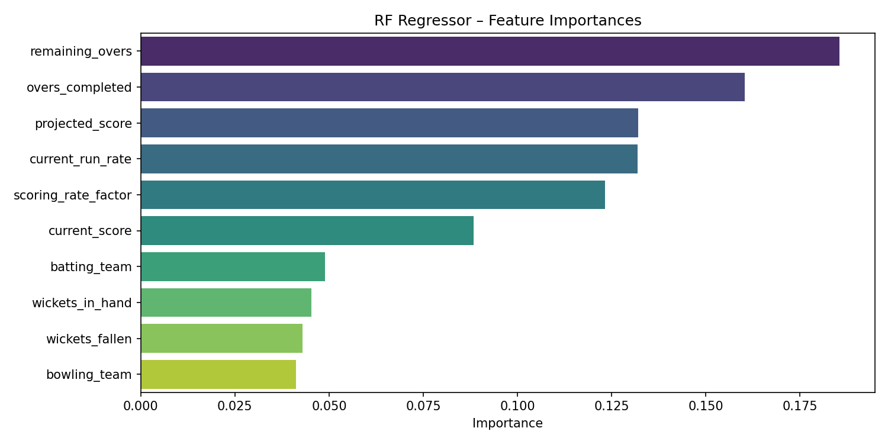
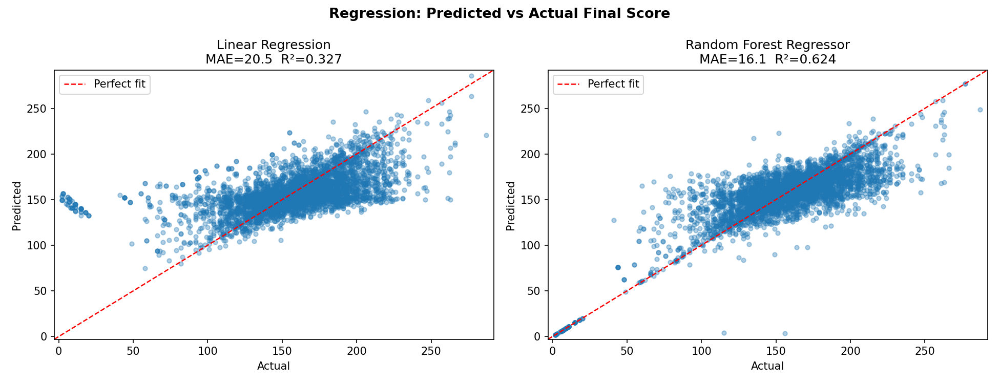

# Cricket Score Prediction System

A machine-learning system that predicts the **final score** of a batting team
during an ongoing IPL T20 match, based on current match conditions.
Trained on the real IPL ball-by-ball dataset (2008–2020).

---

## Project Structure

```
cricket-score-predictor/
|
+-- data/
|   +-- matches.csv                  <- training dataset (generated from real IPL data)
|   +-- prepare_real_data.py         <- converts raw Kaggle CSVs -> matches.csv
|   +-- generate_sample_data.py      <- legacy: synthetic data generator (kept for reference)
|   +-- raw/                         <- gitignored: Kaggle download goes here
|
+-- src/
|   +-- preprocess.py                <- data loading, cleaning, team encoding
|   +-- features.py                  <- feature engineering (remaining overs, etc.)
|   +-- train.py                     <- model training & evaluation pipeline
|   +-- predict.py                   <- inference / prediction logic
|   +-- app.py                       <- (Bonus) Flask REST API
|
+-- model/
|   +-- model.pkl                    <- saved best model (created after training)
|   +-- encoders.pkl                 <- saved LabelEncoders for team names
|   +-- feature_importance.png       <- RF feature importance chart
|   +-- predictions_vs_actual.png    <- predicted vs actual scatter plot
|
+-- main.py                          <- CLI entry point
+-- requirements.txt
+-- README.md
```

---

## Dataset

Training data is sourced from the **IPL Complete Dataset (2008–2020)** on Kaggle
([patrickb1912/ipl-complete-dataset-20082020](https://www.kaggle.com/datasets/patrickb1912/ipl-complete-dataset-20082020)).

The raw dataset contains 260,920 ball-by-ball delivery records across 1,095 matches.
`data/prepare_real_data.py` transforms this into **22,170 training snapshots** by
sampling match state at the end of every 2 completed overs (overs 2, 4, 6 … 20)
for each innings, giving the model many partial-innings views per match.

To regenerate `data/matches.csv` from scratch:
```bash
# Download raw data
kaggle datasets download -d patrickb1912/ipl-complete-dataset-20082020 --path data/raw --unzip

# Build training CSV
python data/prepare_real_data.py
```

---

## Setup

```bash
# 1. Create a virtual environment (recommended)
python -m venv venv
venv\Scripts\activate          # Windows
source venv/bin/activate       # macOS / Linux

# 2. Install dependencies
pip install -r requirements.txt
```

---

## Running the System

### Option A – CLI (train + predict in one shot)

```bash
# First run: trains the model, then launches the predictor
python main.py

# Force a retrain (e.g. after replacing matches.csv)
python main.py --train
```

### Option B – Run steps separately

```bash
# Step 1: (optional) regenerate matches.csv from raw Kaggle data
python data/prepare_real_data.py

# Step 2: train the models
python src/train.py

# Step 3: run the predictor
python main.py
```

### Option C – Flask API (Bonus)

```bash
python src/app.py
```

Then call the endpoint:

```bash
curl -X POST http://localhost:5000/predict \
     -H "Content-Type: application/json" \
     -d "{\"batting_team\": \"Mumbai Indians\", \"bowling_team\": \"Chennai Super Kings\", \"current_score\": 98, \"overs_completed\": 12.0, \"wickets_fallen\": 3, \"current_run_rate\": 8.17}"
```

---

## Input Parameters

| Field              | Type  | Description                              |
|--------------------|-------|------------------------------------------|
| `batting_team`     | str   | Name of the batting team                 |
| `bowling_team`     | str   | Name of the fielding team                |
| `current_score`    | int   | Runs scored so far                       |
| `overs_completed`  | float | Overs bowled (e.g. `12.0`)              |
| `wickets_fallen`   | int   | Wickets lost (0–10)                      |
| `current_run_rate` | float | CRR = current_score / overs_completed    |

---

## Engineered Features

| Feature              | Meaning                                                    |
|----------------------|------------------------------------------------------------|
| `remaining_overs`    | Overs left to bowl (20 - overs_completed)                  |
| `wickets_in_hand`    | Batting resources remaining (10 - wickets_fallen)          |
| `projected_score`    | Naive CRR-based final score projection                     |
| `scoring_rate_factor`| CRR normalised to average T20 run rate (~7.5)              |

---

## Model Performance (Real IPL Data)

Evaluated on a held-out 20% test split of the 22,170 real IPL match snapshots.
These are **actual numbers** from the trained models — not estimates.

| Model                     | MAE (runs) | R²     |
|---------------------------|-----------|--------|
| Linear Regression         | **20.50** | 0.327  |
| Random Forest Regressor   | **16.11** | 0.624  |

The Random Forest model is automatically saved as `model/model.pkl`.

**Interpreting the numbers:** An MAE of ~16 runs on real IPL data means the model
is off by roughly 16 runs on average at the end of an innings. This is meaningfully
harder than the synthetic dataset (which had artificially low variance), and reflects
the genuine unpredictability of T20 cricket — late-over acceleration, sudden collapses,
and weather/pitch effects are all unaccounted for by the current feature set.

### Feature Importance



### Predictions vs Actual



---

## Expected Output (CLI)

```
+======================================================+
|                  PREDICTION RESULT                   |
+======================================================+
|  Batting Team    : Mumbai Indians                    |
|  Current Score   : 98                                |
|  Overs Completed : 12.0                              |
|  Wickets Fallen  : 3                                 |
|  Remaining Overs : 8.0                               |
|  Wickets in Hand : 7                                 |
+======================================================+
|  Predicted Final Score : ~178                        |
|  Confidence Range      : ~162 – ~194                 |
|  Simple CRR Projection : 163                         |
+======================================================+
```

---

## Tech Stack

- **Python 3.12**
- `pandas` · `numpy` – data handling
- `scikit-learn` – ML models (LinearRegression, RandomForestRegressor)
- `matplotlib` · `seaborn` – visualisations
- `flask` – REST API (bonus)
- `pickle` – model persistence

---

## Next Steps

The current MAE of ~16 runs leaves clear room for improvement. Honest priorities:

1. **Better features** — add recent form (last 3 overs run rate), powerplay score,
   batter quality (career strike rate), bowler economy. These are the biggest drivers
   of late-innings acceleration that the model currently cannot see.

2. **Match-aware splitting** — the current train/test split is random across snapshots,
   meaning multiple snapshots of the same match appear in both train and test.
   A proper split should hold out entire **matches** (or seasons), which will likely
   raise MAE and give more realistic generalisation estimates.

3. **Venue and conditions** — pitch type, dew factor, and stadium dimensions
   (ground size affects boundary frequency) are strong confounders absent from the model.

4. **Gradient Boosting / XGBoost** — likely to outperform Random Forest on this
   tabular data without major feature engineering work.

5. **2nd-innings separate model** — 1st- and 2nd-innings dynamics are meaningfully
   different (chase pressure, target knowledge). Training separate models per innings
   rather than a single combined model would likely improve accuracy for both.

6. **More recent data** — the dataset covers 2008–2020. T20 cricket has evolved
   significantly; a model trained only on older seasons may underestimate modern
   scoring rates.
